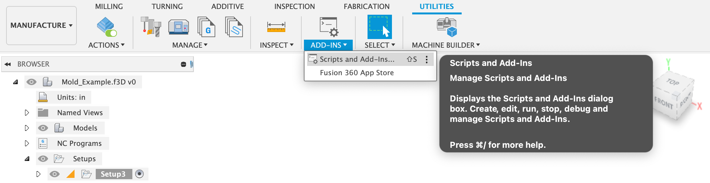
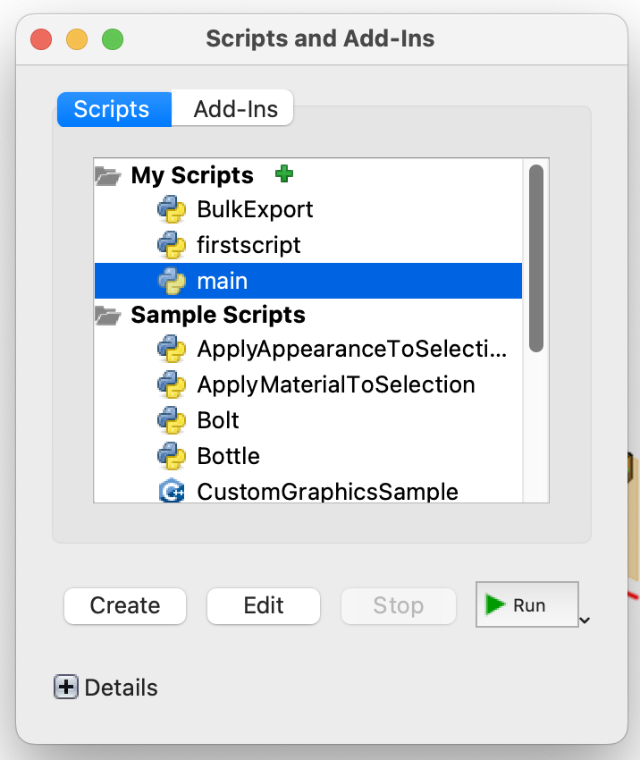
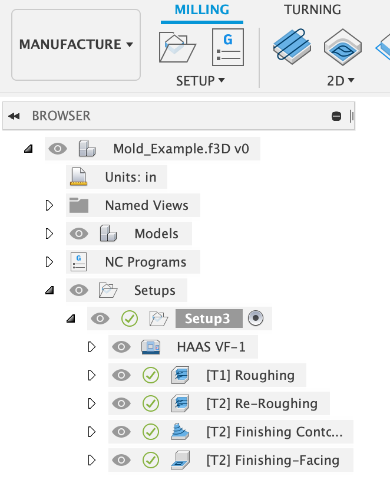

# Fusion_CAMcheck: 

Utilizes Fusion360 API Integration to check operations and settings in the Manufacturing tab 

Built for UIUC ME270

## Getting Started

Official Autodesk Fusion360 guide for script add-ins: 
https://help.autodesk.com/view/fusion360/ENU/?guid=GUID-9701BBA7-EC0E-4016-A9C8-964AA4838954

To run program, click on ADD-INS in the UTILITIES tab of the MANUFACTURE workspace. 

select the downloaded python program file and run.

## Use Cases

## Troubleshooting

Per course instructions document, Setup should have only one setup created. This can be viewed in the tree on the left side of the workspace screen.

## License

This project is licensed under the MIT License 

